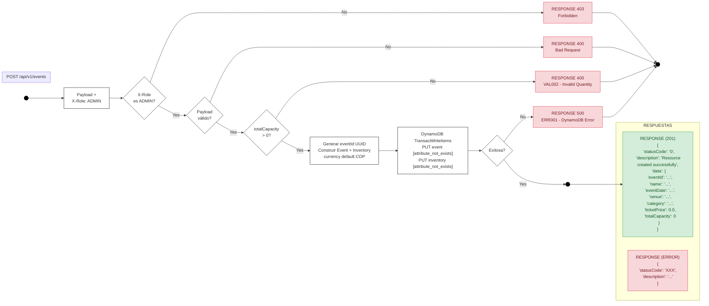

```mermaid
graph LR
    classDef start_end fill:#000,stroke:#000,color:#fff,stroke-width:2px;
    classDef process fill:#fff,stroke:#000,stroke-width:1px;
    classDef decision fill:#fff,stroke:#000,stroke-width:1px;
    classDef success fill:#d4edda,stroke:#28a745,stroke-width:1px,color:#155724;
    classDef error fill:#f8d7da,stroke:#dc3545,stroke-width:1px,color:#721c24;

    subgraph Header ["POST /api/v1/events"]
        direction LR
    end

    Start(( )) --> Payload[Payload +<br/>X-Role: ADMIN]
    Payload --> ValidaRol{X-Role<br/>es ADMIN?}

    ValidaRol -- No --> R403[RESPONSE 403<br/>Forbidden]
    ValidaRol -- Yes --> ValidaPayload{Payload<br/>válido?}

    ValidaPayload -- No --> R400[RESPONSE 400<br/>Bad Request]
    ValidaPayload -- Yes --> ValidaCapacidad{totalCapacity<br/>> 0?}

    ValidaCapacidad -- No --> R400b[RESPONSE 400<br/>VAL002 - Invalid Quantity]
    ValidaCapacidad -- Yes --> GenID[Generar eventId UUID<br/>Construir Event + Inventory<br/>currency default COP]

    GenID --> Transaccion["DynamoDB TransactWriteItems<br/>PUT event [attribute_not_exists]<br/>PUT inventory [attribute_not_exists]"]

    Transaccion --> Exitosa{Exitosa?}
    Exitosa -- No --> R500[RESPONSE 500<br/>ERR001 - DynamoDB Error]
    Exitosa -- Yes --> SuccessNode(( ))
    SuccessNode --> R201

    subgraph RESPONSES ["RESPUESTAS"]
        R201["RESPONSE (201)<br/>{<br/>  'statusCode': '0',<br/>  'description': 'Resource created successfully',<br/>  'data': {<br/>    'eventId': '...',<br/>    'name': '...',<br/>    'eventDate': '...',<br/>    'venue': '...',<br/>    'category': '...',<br/>    'ticketPrice': 0.0,<br/>    'totalCapacity': 0<br/>  }<br/>}"]
        R_ERR["RESPONSE (ERROR)<br/>{<br/>  'statusCode': 'XXX',<br/>  'description': '...'<br/>}"]
    end

    R400 --> EndNode(( ))
    R400b --> EndNode
    R403 --> EndNode
    R500 --> EndNode

    class Start,SuccessNode,EndNode start_end;
    class Payload,GenID,Transaccion process;
    class ValidaRol,ValidaPayload,ValidaCapacidad,Exitosa decision;
    class R201 success;
    class R400,R400b,R403,R500,R_ERR error;
```
