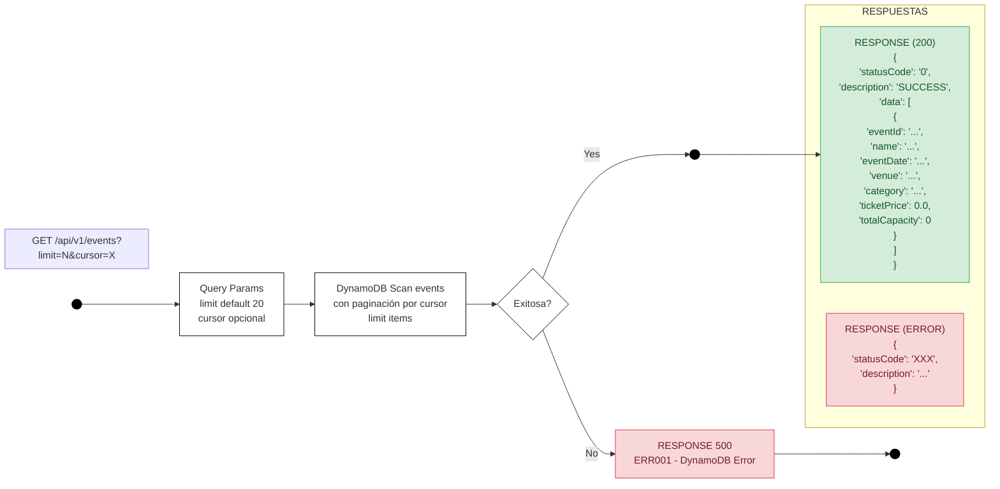

```mermaid
graph LR
    classDef start_end fill:#000,stroke:#000,color:#fff,stroke-width:2px;
    classDef process fill:#fff,stroke:#000,stroke-width:1px;
    classDef decision fill:#fff,stroke:#000,stroke-width:1px;
    classDef success fill:#d4edda,stroke:#28a745,stroke-width:1px,color:#155724;
    classDef error fill:#f8d7da,stroke:#dc3545,stroke-width:1px,color:#721c24;

    subgraph Header ["GET /api/v1/events?limit=N&cursor=X"]
        direction LR
    end

    Start(( )) --> Params[Query Params<br/>limit default 20<br/>cursor opcional]
    Params --> Consulta["DynamoDB Scan events<br/>con paginación por cursor<br/>limit items"]

    Consulta --> Exitosa{Exitosa?}
    Exitosa -- No --> R500[RESPONSE 500<br/>ERR001 - DynamoDB Error]
    Exitosa -- Yes --> SuccessNode(( ))
    SuccessNode --> R200

    subgraph RESPONSES ["RESPUESTAS"]
        R200["RESPONSE (200)<br/>{<br/>  'statusCode': '0',<br/>  'description': 'SUCCESS',<br/>  'data': [<br/>    {<br/>      'eventId': '...',<br/>      'name': '...',<br/>      'eventDate': '...',<br/>      'venue': '...',<br/>      'category': '...',<br/>      'ticketPrice': 0.0,<br/>      'totalCapacity': 0<br/>    }<br/>  ]<br/>}"]
        R_ERR["RESPONSE (ERROR)<br/>{<br/>  'statusCode': 'XXX',<br/>  'description': '...'<br/>}"]
    end

    R500 --> EndNode(( ))

    class Start,SuccessNode,EndNode start_end;
    class Params,Consulta process;
    class Exitosa decision;
    class R200 success;
    class R500,R_ERR error;
```
