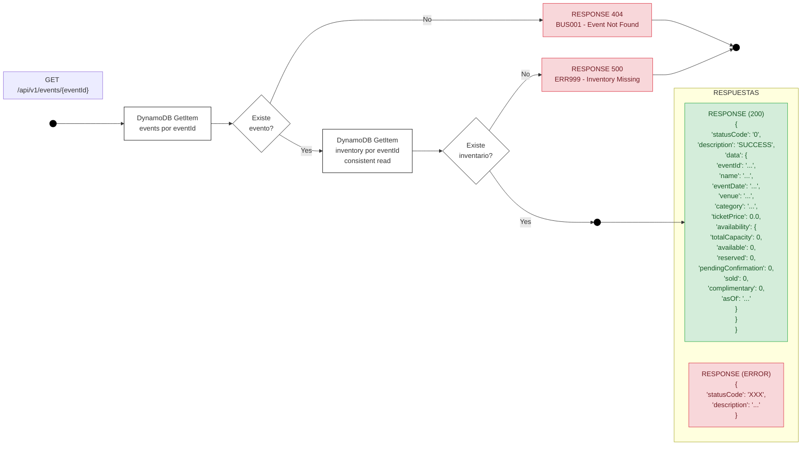

```mermaid
graph LR
    classDef start_end fill:#000,stroke:#000,color:#fff,stroke-width:2px;
    classDef process fill:#fff,stroke:#000,stroke-width:1px;
    classDef decision fill:#fff,stroke:#000,stroke-width:1px;
    classDef success fill:#d4edda,stroke:#28a745,stroke-width:1px,color:#155724;
    classDef error fill:#f8d7da,stroke:#dc3545,stroke-width:1px,color:#721c24;

    subgraph Header ["GET /api/v1/events/{eventId}"]
        direction LR
    end

    Start(( )) --> BuscarEvento["DynamoDB GetItem<br/>events por eventId"]

    BuscarEvento --> ExisteEvento{Existe<br/>evento?}
    ExisteEvento -- No --> R404[RESPONSE 404<br/>BUS001 - Event Not Found]
    ExisteEvento -- Yes --> BuscarInventario["DynamoDB GetItem<br/>inventory por eventId<br/>consistent read"]

    BuscarInventario --> ExisteInventario{Existe<br/>inventario?}
    ExisteInventario -- No --> R500[RESPONSE 500<br/>ERR999 - Inventory Missing]
    ExisteInventario -- Yes --> SuccessNode(( ))
    SuccessNode --> R200

    subgraph RESPONSES ["RESPUESTAS"]
        R200["RESPONSE (200)<br/>{<br/>  'statusCode': '0',<br/>  'description': 'SUCCESS',<br/>  'data': {<br/>    'eventId': '...',<br/>    'name': '...',<br/>    'eventDate': '...',<br/>    'venue': '...',<br/>    'category': '...',<br/>    'ticketPrice': 0.0,<br/>    'availability': {<br/>      'totalCapacity': 0,<br/>      'available': 0,<br/>      'reserved': 0,<br/>      'pendingConfirmation': 0,<br/>      'sold': 0,<br/>      'complimentary': 0,<br/>      'asOf': '...'<br/>    }<br/>  }<br/>}"]
        R_ERR["RESPONSE (ERROR)<br/>{<br/>  'statusCode': 'XXX',<br/>  'description': '...'<br/>}"]
    end

    R404 --> EndNode(( ))
    R500 --> EndNode

    class Start,SuccessNode,EndNode start_end;
    class BuscarEvento,BuscarInventario process;
    class ExisteEvento,ExisteInventario decision;
    class R200 success;
    class R404,R500,R_ERR error;
```
