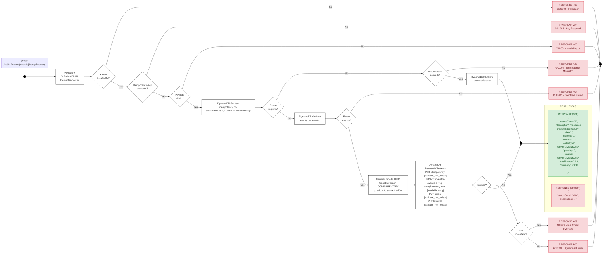

```mermaid
graph LR
    classDef start_end fill:#000,stroke:#000,color:#fff,stroke-width:2px;
    classDef process fill:#fff,stroke:#000,stroke-width:1px;
    classDef decision fill:#fff,stroke:#000,stroke-width:1px;
    classDef success fill:#d4edda,stroke:#28a745,stroke-width:1px,color:#155724;
    classDef error fill:#f8d7da,stroke:#dc3545,stroke-width:1px,color:#721c24;

    subgraph Header ["POST /api/v1/events/{eventId}/complimentary"]
        direction LR
    end

    Start(( )) --> Payload[Payload +<br/>X-Role: ADMIN<br/>Idempotency-Key]

    Payload --> ValidaRol{X-Role<br/>es ADMIN?}
    ValidaRol -- No --> R403[RESPONSE 403<br/>SEC002 - Forbidden]

    ValidaRol -- Yes --> ValidaKey{Idempotency-Key<br/>presente?}
    ValidaKey -- No --> R400[RESPONSE 400<br/>VAL003 - Key Required]

    ValidaKey -- Yes --> ValidaPayload{Payload<br/>válido?}
    ValidaPayload -- No --> R400b[RESPONSE 400<br/>VAL001 - Invalid Input]

    ValidaPayload -- Yes --> BuscarIdempotencia["DynamoDB GetItem<br/>idempotency por<br/>adminId#POST_COMPLIMENTARY#key"]

    BuscarIdempotencia --> ExisteIdempotencia{Existe<br/>registro?}

    ExisteIdempotencia -- Yes --> ValidaHash{requestHash<br/>coincide?}
    ValidaHash -- No --> R422[RESPONSE 422<br/>VAL004 - Idempotency Mismatch]
    ValidaHash -- Yes --> BuscarOrdenExistente["DynamoDB GetItem<br/>orden existente"]
    BuscarOrdenExistente --> SuccessNode(( ))

    ExisteIdempotencia -- No --> BuscarEvento["DynamoDB GetItem<br/>events por eventId"]
    BuscarEvento --> ExisteEvento{Existe<br/>evento?}
    ExisteEvento -- No --> R404[RESPONSE 404<br/>BUS001 - Event Not Found]

    ExisteEvento -- Yes --> GenID["Generar orderId UUID<br/>Construir orden COMPLIMENTARY<br/>precio = 0, sin expiración"]

    GenID --> Transaccion["DynamoDB TransactWriteItems<br/>PUT idempotency [attribute_not_exists]<br/>UPDATE inventory available -= q, complimentary += q [available >= q]<br/>PUT orden [attribute_not_exists]<br/>PUT historial [attribute_not_exists]"]

    Transaccion --> Exitosa{Exitosa?}
    Exitosa -- No --> ValidaInventario{Sin<br/>inventario?}
    ValidaInventario -- Yes --> R409[RESPONSE 409<br/>BUS002 - Insufficient Inventory]
    ValidaInventario -- No --> R500[RESPONSE 500<br/>ERR001 - DynamoDB Error]

    Exitosa -- Yes --> SuccessNode
    SuccessNode --> R201

    subgraph RESPONSES ["RESPUESTAS"]
        R201["RESPONSE (201)<br/>{<br/>  'statusCode': '0',<br/>  'description': 'Resource created successfully',<br/>  'data': {<br/>    'orderId': '...',<br/>    'eventId': '...',<br/>    'orderType': 'COMPLIMENTARY',<br/>    'quantity': 0,<br/>    'status': 'COMPLIMENTARY',<br/>    'totalAmount': 0.0,<br/>    'currency': 'COP'<br/>  }<br/>}"]
        R_ERR["RESPONSE (ERROR)<br/>{<br/>  'statusCode': 'XXX',<br/>  'description': '...'<br/>}"]
    end

    R400 --> EndNode(( ))
    R400b --> EndNode
    R403 --> EndNode
    R404 --> EndNode
    R409 --> EndNode
    R422 --> EndNode
    R500 --> EndNode

    class Start,SuccessNode,EndNode start_end;
    class Payload,BuscarIdempotencia,BuscarOrdenExistente,BuscarEvento,GenID,Transaccion process;
    class ValidaRol,ValidaKey,ValidaPayload,ExisteIdempotencia,ValidaHash,ExisteEvento,Exitosa,ValidaInventario decision;
    class R201 success;
    class R400,R400b,R403,R404,R409,R422,R500,R_ERR error;
```
