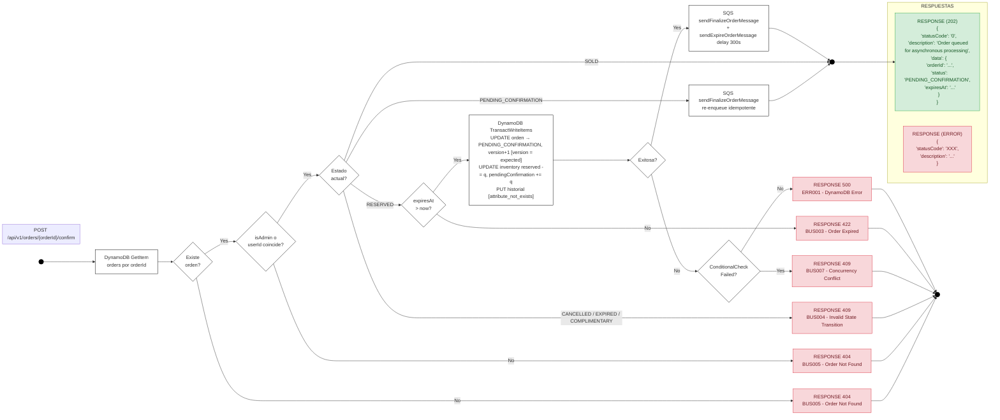

```mermaid
graph LR
    classDef start_end fill:#000,stroke:#000,color:#fff,stroke-width:2px;
    classDef process fill:#fff,stroke:#000,stroke-width:1px;
    classDef decision fill:#fff,stroke:#000,stroke-width:1px;
    classDef success fill:#d4edda,stroke:#28a745,stroke-width:1px,color:#155724;
    classDef error fill:#f8d7da,stroke:#dc3545,stroke-width:1px,color:#721c24;

    subgraph Header ["POST /api/v1/orders/{orderId}/confirm"]
        direction LR
    end

    Start(( )) --> BuscarOrden["DynamoDB GetItem<br/>orders por orderId"]

    BuscarOrden --> ExisteOrden{Existe<br/>orden?}
    ExisteOrden -- No --> R404[RESPONSE 404<br/>BUS005 - Order Not Found]

    ExisteOrden -- Yes --> ValidaAcceso{isAdmin o<br/>userId coincide?}
    ValidaAcceso -- No --> R404b[RESPONSE 404<br/>BUS005 - Order Not Found]

    ValidaAcceso -- Yes --> EvaluaEstado{Estado<br/>actual?}

    EvaluaEstado -- PENDING_CONFIRMATION --> ReencolarSQS["SQS sendFinalizeOrderMessage<br/>re-enqueue idempotente"]
    ReencolarSQS --> SuccessNode(( ))

    EvaluaEstado -- SOLD --> SuccessNode

    EvaluaEstado -- CANCELLED / EXPIRED / COMPLIMENTARY --> R409[RESPONSE 409<br/>BUS004 - Invalid State Transition]

    EvaluaEstado -- RESERVED --> ValidaExpiracion{expiresAt<br/>> now?}
    ValidaExpiracion -- No --> R422[RESPONSE 422<br/>BUS003 - Order Expired]

    ValidaExpiracion -- Yes --> Transaccion["DynamoDB TransactWriteItems<br/>UPDATE orden → PENDING_CONFIRMATION, version+1 [version = expected]<br/>UPDATE inventory reserved -= q, pendingConfirmation += q<br/>PUT historial [attribute_not_exists]"]

    Transaccion --> Exitosa{Exitosa?}
    Exitosa -- No --> EsConflicto{ConditionalCheck<br/>Failed?}
    EsConflicto -- Yes --> R409con[RESPONSE 409<br/>BUS007 - Concurrency Conflict]
    EsConflicto -- No --> R500[RESPONSE 500<br/>ERR001 - DynamoDB Error]

    Exitosa -- Yes --> EnviarSQS["SQS sendFinalizeOrderMessage<br/>+ sendExpireOrderMessage delay 300s"]
    EnviarSQS --> SuccessNode
    SuccessNode --> R202

    subgraph RESPONSES ["RESPUESTAS"]
        R202["RESPONSE (202)<br/>{<br/>  'statusCode': '0',<br/>  'description': 'Order queued for asynchronous processing',<br/>  'data': {<br/>    'orderId': '...',<br/>    'status': 'PENDING_CONFIRMATION',<br/>    'expiresAt': '...'<br/>  }<br/>}"]
        R_ERR["RESPONSE (ERROR)<br/>{<br/>  'statusCode': 'XXX',<br/>  'description': '...'<br/>}"]
    end

    R404 --> EndNode(( ))
    R404b --> EndNode
    R409 --> EndNode
    R409con --> EndNode
    R422 --> EndNode
    R500 --> EndNode

    class Start,SuccessNode,EndNode start_end;
    class BuscarOrden,ReencolarSQS,Transaccion,EnviarSQS process;
    class ExisteOrden,ValidaAcceso,EvaluaEstado,ValidaExpiracion,Exitosa,EsConflicto decision;
    class R202 success;
    class R404,R404b,R409,R409con,R422,R500,R_ERR error;
```
