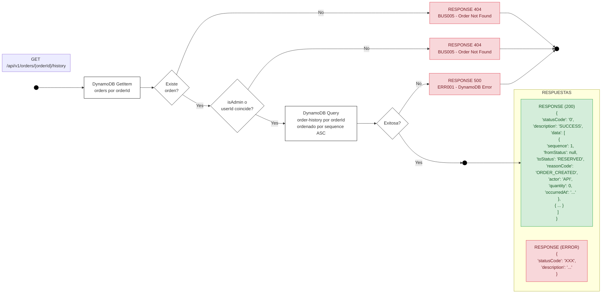

```mermaid
graph LR
    classDef start_end fill:#000,stroke:#000,color:#fff,stroke-width:2px;
    classDef process fill:#fff,stroke:#000,stroke-width:1px;
    classDef decision fill:#fff,stroke:#000,stroke-width:1px;
    classDef success fill:#d4edda,stroke:#28a745,stroke-width:1px,color:#155724;
    classDef error fill:#f8d7da,stroke:#dc3545,stroke-width:1px,color:#721c24;

    subgraph Header ["GET /api/v1/orders/{orderId}/history"]
        direction LR
    end

    Start(( )) --> BuscarOrden["DynamoDB GetItem<br/>orders por orderId"]

    BuscarOrden --> ExisteOrden{Existe<br/>orden?}
    ExisteOrden -- No --> R404[RESPONSE 404<br/>BUS005 - Order Not Found]

    ExisteOrden -- Yes --> ValidaAcceso{isAdmin o<br/>userId coincide?}
    ValidaAcceso -- No --> R404b[RESPONSE 404<br/>BUS005 - Order Not Found]

    ValidaAcceso -- Yes --> BuscarHistorial["DynamoDB Query<br/>order-history por orderId<br/>ordenado por sequence ASC"]

    BuscarHistorial --> Exitosa{Exitosa?}
    Exitosa -- No --> R500[RESPONSE 500<br/>ERR001 - DynamoDB Error]
    Exitosa -- Yes --> SuccessNode(( ))
    SuccessNode --> R200

    subgraph RESPONSES ["RESPUESTAS"]
        R200["RESPONSE (200)<br/>{<br/>  'statusCode': '0',<br/>  'description': 'SUCCESS',<br/>  'data': [<br/>    {<br/>      'sequence': 1,<br/>      'fromStatus': null,<br/>      'toStatus': 'RESERVED',<br/>      'reasonCode': 'ORDER_CREATED',<br/>      'actor': 'API',<br/>      'quantity': 0,<br/>      'occurredAt': '...'<br/>    },<br/>    { ... }<br/>  ]<br/>}"]
        R_ERR["RESPONSE (ERROR)<br/>{<br/>  'statusCode': 'XXX',<br/>  'description': '...'<br/>}"]
    end

    R404 --> EndNode(( ))
    R404b --> EndNode
    R500 --> EndNode

    class Start,SuccessNode,EndNode start_end;
    class BuscarOrden,BuscarHistorial process;
    class ExisteOrden,ValidaAcceso,Exitosa decision;
    class R200 success;
    class R404,R404b,R500,R_ERR error;
```
