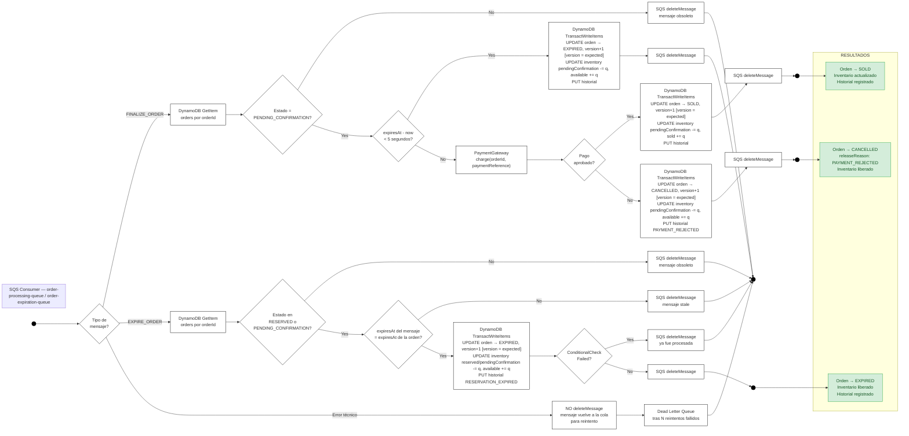

```mermaid
graph LR
    classDef start_end fill:#000,stroke:#000,color:#fff,stroke-width:2px;
    classDef process fill:#fff,stroke:#000,stroke-width:1px;
    classDef decision fill:#fff,stroke:#000,stroke-width:1px;
    classDef success fill:#d4edda,stroke:#28a745,stroke-width:1px,color:#155724;
    classDef error fill:#f8d7da,stroke:#dc3545,stroke-width:1px,color:#721c24;

    subgraph Header ["SQS Consumer — order-processing-queue / order-expiration-queue"]
        direction LR
    end

    Start(( )) --> TipoMensaje{Tipo de<br/>mensaje?}

    %% ── PROCESSING QUEUE ──
    TipoMensaje -- FINALIZE_ORDER --> BuscarOrdenP["DynamoDB GetItem<br/>orders por orderId"]
    BuscarOrdenP --> EstadoPending{Estado =<br/>PENDING_CONFIRMATION?}
    EstadoPending -- No --> DeleteMsgP["SQS deleteMessage<br/>mensaje obsoleto"]
    DeleteMsgP --> EndNode(( ))

    EstadoPending -- Yes --> CercaExpiracion{expiresAt - now<br/>< 5 segundos?}

    CercaExpiracion -- Yes --> ExpiracionPago["DynamoDB TransactWriteItems<br/>UPDATE orden → EXPIRED, version+1 [version = expected]<br/>UPDATE inventory pendingConfirmation -= q, available += q<br/>PUT historial"]
    ExpiracionPago --> DeleteMsgP2["SQS deleteMessage"]
    DeleteMsgP2 --> EndNode

    CercaExpiracion -- No --> CobrarPago["PaymentGateway<br/>charge(orderId, paymentReference)"]

    CobrarPago --> PagoAprobado{Pago<br/>aprobado?}

    PagoAprobado -- Yes --> FinalizarVenta["DynamoDB TransactWriteItems<br/>UPDATE orden → SOLD, version+1 [version = expected]<br/>UPDATE inventory pendingConfirmation -= q, sold += q<br/>PUT historial"]
    FinalizarVenta --> DeleteMsgP3["SQS deleteMessage"]
    DeleteMsgP3 --> SuccessVenta(( ))
    SuccessVenta --> R_SOLD["Orden → SOLD<br/>Inventario actualizado<br/>Historial registrado"]

    PagoAprobado -- No --> RechazarPago["DynamoDB TransactWriteItems<br/>UPDATE orden → CANCELLED, version+1 [version = expected]<br/>UPDATE inventory pendingConfirmation -= q, available += q<br/>PUT historial PAYMENT_REJECTED"]
    RechazarPago --> DeleteMsgP4["SQS deleteMessage"]
    DeleteMsgP4 --> SuccessCancelled(( ))
    SuccessCancelled --> R_CANCELLED["Orden → CANCELLED<br/>releaseReason: PAYMENT_REJECTED<br/>Inventario liberado"]

    %% ── EXPIRATION QUEUE ──
    TipoMensaje -- EXPIRE_ORDER --> BuscarOrdenE["DynamoDB GetItem<br/>orders por orderId"]
    BuscarOrdenE --> EstadoExpirable{Estado en<br/>RESERVED o<br/>PENDING_CONFIRMATION?}
    EstadoExpirable -- No --> DeleteMsgE["SQS deleteMessage<br/>mensaje obsoleto"]
    DeleteMsgE --> EndNode

    EstadoExpirable -- Yes --> ValidaDeadline{expiresAt del mensaje<br/>= expiresAt de la orden?}
    ValidaDeadline -- No --> DeleteMsgE2["SQS deleteMessage<br/>mensaje stale"]
    DeleteMsgE2 --> EndNode

    ValidaDeadline -- Yes --> ExpirarOrden["DynamoDB TransactWriteItems<br/>UPDATE orden → EXPIRED, version+1 [version = expected]<br/>UPDATE inventory reserved/pendingConfirmation -= q, available += q<br/>PUT historial RESERVATION_EXPIRED"]
    ExpirarOrden --> ConflictoExp{ConditionalCheck<br/>Failed?}
    ConflictoExp -- Yes --> DeleteMsgE3["SQS deleteMessage<br/>ya fue procesada"]
    DeleteMsgE3 --> EndNode
    ConflictoExp -- No --> DeleteMsgE4["SQS deleteMessage"]
    DeleteMsgE4 --> SuccessExpired(( ))
    SuccessExpired --> R_EXPIRED["Orden → EXPIRED<br/>Inventario liberado<br/>Historial registrado"]

    %% ── ERROR PATH ──
    TipoMensaje -- Error técnico --> NoDelete["NO deleteMessage<br/>mensaje vuelve a la cola<br/>para reintento"]
    NoDelete --> DLQ["Dead Letter Queue<br/>tras N reintentos fallidos"]
    DLQ --> EndNode

    subgraph OUTCOMES ["RESULTADOS"]
        R_SOLD
        R_CANCELLED
        R_EXPIRED
    end

    class Start,SuccessVenta,SuccessCancelled,SuccessExpired,EndNode start_end;
    class BuscarOrdenP,BuscarOrdenE,CobrarPago,FinalizarVenta,RechazarPago,ExpiracionPago,ExpirarOrden,DeleteMsgP,DeleteMsgP2,DeleteMsgP3,DeleteMsgP4,DeleteMsgE,DeleteMsgE2,DeleteMsgE3,DeleteMsgE4,NoDelete,DLQ process;
    class TipoMensaje,EstadoPending,CercaExpiracion,PagoAprobado,EstadoExpirable,ValidaDeadline,ConflictoExp decision;
    class R_SOLD,R_CANCELLED,R_EXPIRED success;
```
